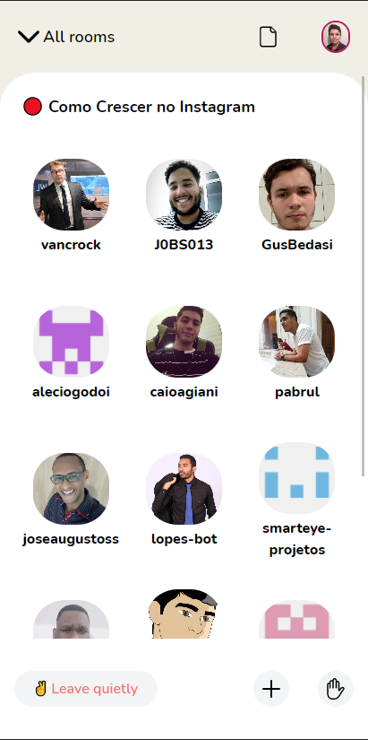
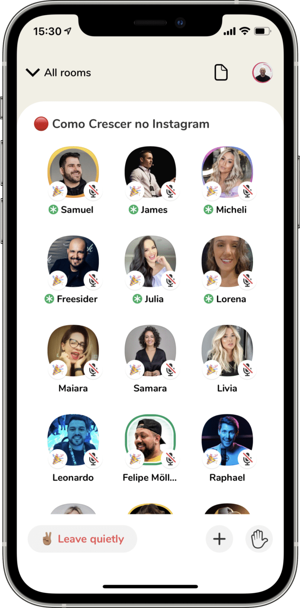

# Clone do Clubhouse - Githouse

## Githouse x Clubhouse

  
  

## Githouse

Decidi criar esse projeto depois de ver um vídeo do Mayk Brito, ele criou um clone do Clubhouse em live, utilizando o TailWind. Decidi fazer minha própria versão.

Sendo assim, integrei a API do Github para listar todos os followers, criei também um efeito visual de "skeleton" para poder deixar a aplicação mais dinâmica. 

## Tecnologias
- [ ] HTML
- [ ] CSS
- [ ] TailwindCSS
- [ ] Javascript

## Etapa 1

- [x] Clone da tela principal de interação do Clubhouse.
- [x] Ajustes de fidelidade com TailwindCSS.
- [x] Integração com API do Github.

## Etapa 2

- [ ] Clone da tela de pesquisa e categorias do Clubhouse.
- [ ] Criação de transições e animações.
- [ ] Ajustes de fidelidade com TailwindCSS.

## Etapa 3
- [ ] Clone da tela do feed do Clubhouse.
- [ ] Criação de transições e animações.
- [ ] Ajustes de fidelidade com TailwindCSS.

## Etapa 4
- [ ] Clone da tela de perfil do Clubhouse.
- [ ] Criação de transições e animações.
- [ ] Ajustes de fidelidade com TailwindCSS.
- [ ] Integração com API do Github.

##  Author

- LinkedIn: [Juan Patrick](https://www.linkedin.com/in/juan-patrick/)
- E-mail: juan-p.andrade@outlook.com
- Instagram: @juan.razor
